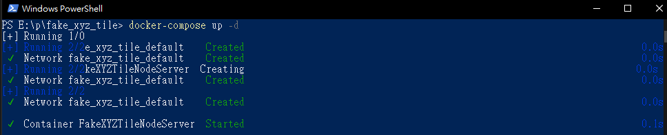
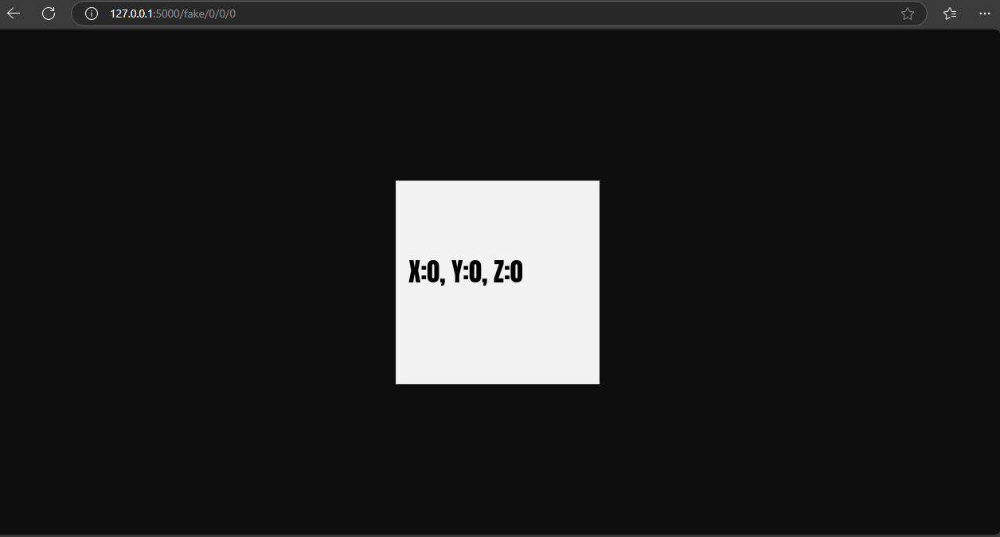
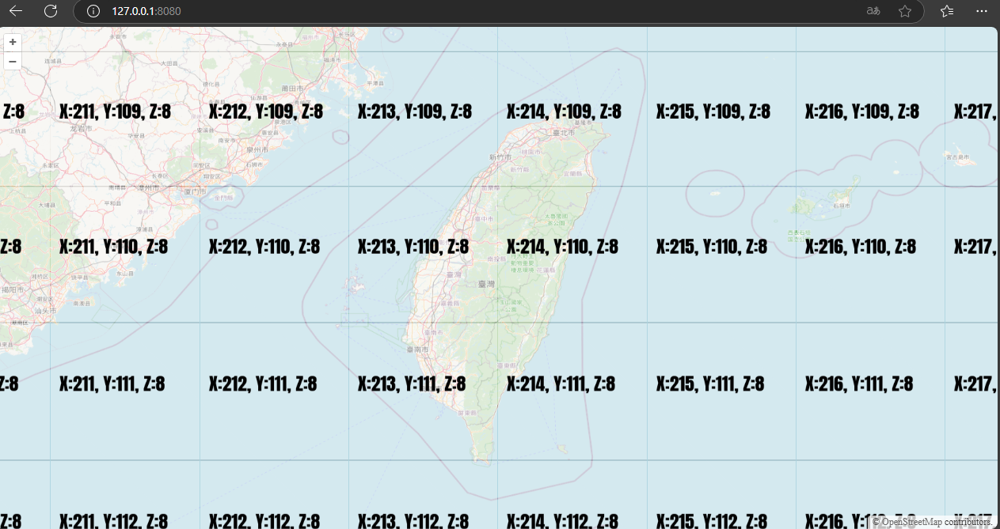

# Fake XYZ Tile Server

## 簡介
透過Canvas產生傳入的XYZ資訊之圖片。

## DEMO
[Youtube](https://youtu.be/XqFnGWzKZoo)
## 使用說明

- 啟用Docker
    ```bash
    docker-compose up -d
    ```
    
- 確認FakeXYZ圖磚服務
  - 打開瀏覽器輸入 http://127.0.0.1:5000/fake/{Z}/{Y}/{X}
  
    
- 透過OpenLayer預覽開啟瀏覽器 
  - 輸入 http://127.0.0.1:8080
    
